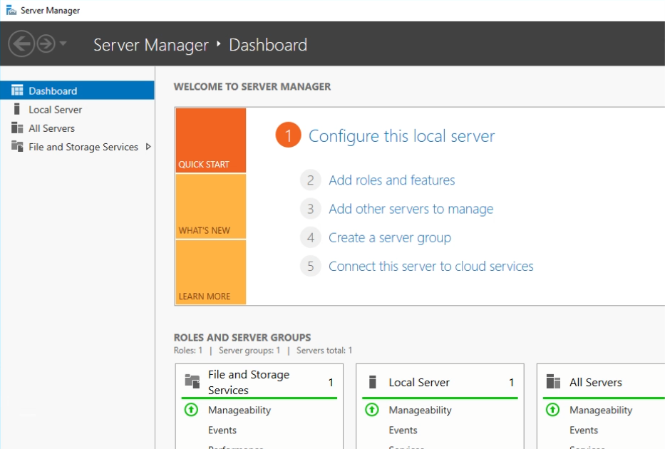

# 🧩 Active Directory Lab — New Forest, User Creation, and Domain Join (Windows Server 2022)

I configured my own **Active Directory Domain Services (AD DS)** on **Windows Server 2022**, created a **new domain user**, and joined a **Windows test machine** to the new domain. This README mirrors the exact clicks I took, including fixing a join error by pointing the client’s **DNS** to the DC and enabling **RDP** for the new domain user.

> 🔐 Screenshot note: blur/replace real hostnames, usernames, and IPs (use `203.0.113.25` / `10.0.0.x`).

---

## 📌 Project Overview
- **DC:** Windows Server 2022 promoted to **AD DS** (new forest)
- **Domain:** `MYDFIR.local` (NetBIOS: `MYDFIR`)
- **Client:** Windows test machine joined to the new domain
- **Accounts:** New user created in **ADUC**
- **Access:** RDP (locked to my IP in cloud firewall)

---

## 🧱 Lab Architecture

| Component     | Role                                    | Notes |
|---            |---                                      |---|
| `DC01`        | Domain Controller (AD DS + DNS)         | Private IP; RDP from my IP |
| `WIN-TEST`    | Domain-joined workstation               | DNS set to DC IP before join |
| VPC/Private   | East–west lab traffic                   | Keep RDP restricted to my IP |

📸 *Diagram placeholder*  


---

## ✅ Prerequisites
- RDP admin access to the server you’ll promote
- (Recommended) Static/reserved IP on the DC
- The **client’s DNS** must point to the **DC IP** to join the domain
- Time in sync (client & DC within ~5 minutes)

---

## 🚀 Steps (What I Actually Did)

### Step 1 — Add the AD DS role on the server
1. **RDP** into the server
2. **Server Manager → Add Roles and Features**
3. Click **Next** until **Server Roles**
4. Check **Active Directory Domain Services** → **Add Features**
5. Click **Next** through the wizard → **Install**

📸 *Screenshot:*  


---

### Step 2 — Promote the server to a Domain Controller
1. In **Server Manager**, click the **warning** flag → **Promote this server to a domain controller**
2. Choose **Add a new forest**
3. **Root domain name:** `**`
4. Set the **DSRM** password
5. **Next** through defaults (DNS/GC enabled) → **Install**
6. The server **restarts** automatically

📸 *Screenshots:*  
  


> After reboot, sign in as **`MYDFIR\Administrator`** (or `Administrator@MYDFIR.local`).

---

### Step 3 — Create a new domain user in ADUC
1. Open **Active Directory Users and Computers** (search: *Active Directory Users and Computers*)
2. Expand your domain **`MYDFIR.local`**
3. Click **Users**
4. **Right-click → New → User**
5. Enter **Name / UPN**, set **password**
6. Finish the wizard

📸 *Screenshots:*  
  


---

### Step 4 — Join the Windows test machine to the domain
1. **RDP** into the **test machine**
2. Search **“This PC”** → right-click **Properties**
3. **Rename this PC (advanced)** → **Change…**
4. Under **Member of**, select **Domain**, enter `MYDFIR.local` (or NetBIOS `MYDFIR`)
5. Provide domain admin creds (e.g., `MYDFIR\Administrator`)

> ❌ I initially received a **domain join error**.

**Fix — set client DNS to the DC IP:**
1. **Network & Internet → Change adapter options**
2. Right-click your **Ethernet** adapter → **Properties**
3. **Internet Protocol Version 4 (TCP/IPv4)** → **Properties**
4. Set **Preferred DNS server** to your **DC IP** (e.g., `10.0.0.10`)
5. OK → OK

Re-attempt the domain join → **Success**, machine prompts to **restart**.

📸 *Screenshots:*  
  
  


---

### Step 5 — Enable RDP for the new domain user
To log in over RDP with the new domain account:

1. (If needed) Use the **provider console** to sign into the test machine as the **new domain user** once
2. Search **“Remote”** → **Allow remote access to your computer**
3. On the **Remote** tab:
   - Ensure **Allow Remote Connections** is enabled
   - Click **Select Users…** → **Add…**
   - Enter the **new domain user** → **Check Names** → **OK** → **OK**

📸 *Screenshots:*  
  


> Alt (PowerShell on the client):
> ```powershell
> net localgroup "Remote Desktop Users" "MYDFIR\yourUser" /add
> ```

---

## 🔎 Validation
- On the client, **System → About** shows **Domain: MYDFIR.local**
- Sign in as **`MYDFIR\yourUser`** over RDP works
- On the DC, ADUC shows:
  - Your **user** under **Users**
  - Your **computer** under **Computers**


🏁 Results

Promoted Windows Server 2022 to a Domain Controller (MYDFIR.local)

Created a new domain user in ADUC

Successfully joined a Windows test machine to the domain

Enabled RDP for the new domain user and confirmed login
